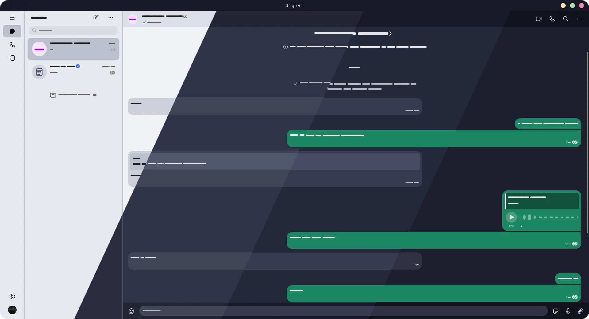
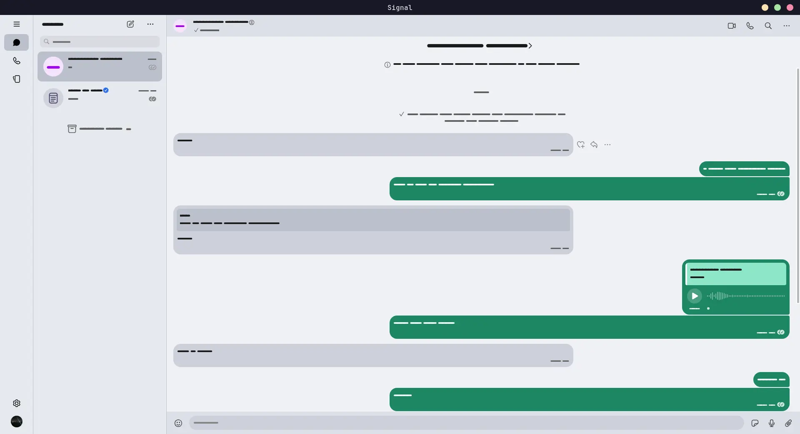
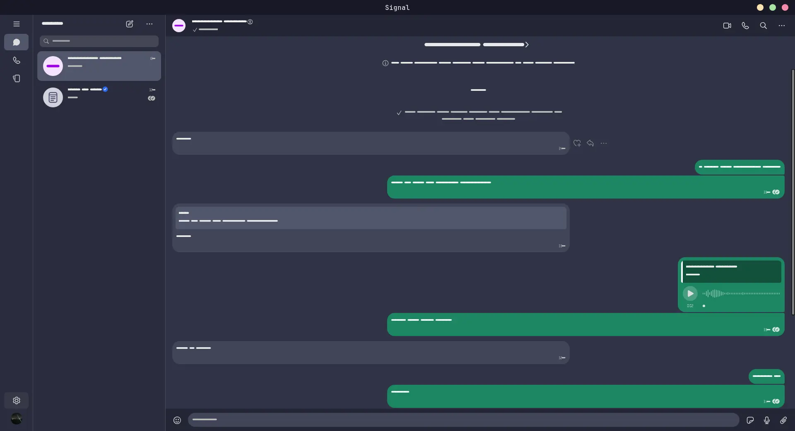
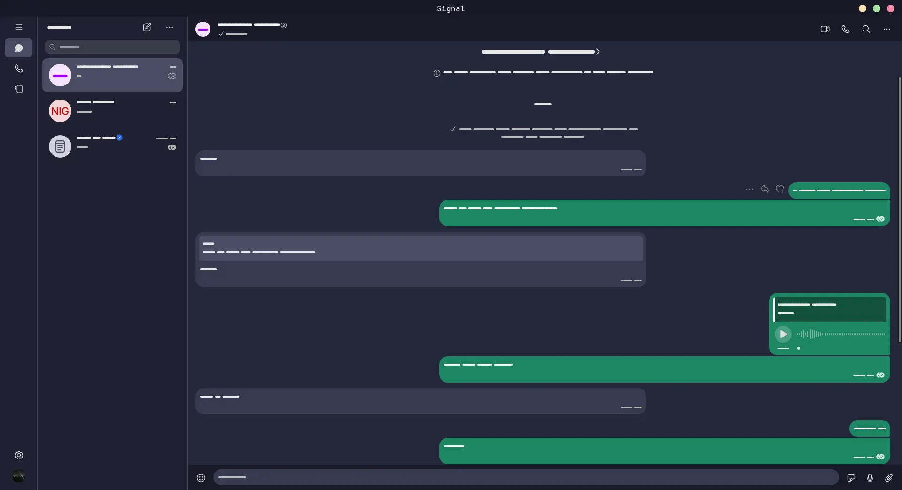
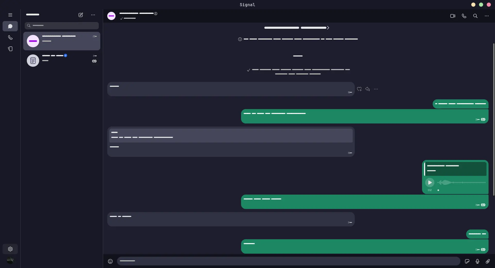

<h3 align="center">
	<br/>
	
	Catppuccin for <a href="https://github.com/signalapp/Signal-Desktop">Signal Desktop</a>
	
</h3>

<p align="center">
	<a href="https://github.com/CalfMoon/signal-desktop/stargazers"></a>
	<a href="https://github.com/CalfMoon/signal-desktop/issues"></a>
	<a href="https://github.com/CalfMoon/signal-desktop/contributors"></a>
</p>

<p align="center">
	
</p>

# Previews

<details>
<summary>🌻 Latte</summary>

</details>
<details>
<summary>🪴 Frappé</summary>

</details>
<details>
<summary>🌺 Macchiato</summary>

</details>
<details>
<summary>🌿 Mocha</summary>

</details>

# Usage

## Windows
1. Install 7-zip and its asar7z plugin.
1. Open `C:\Users\user_name\AppData\Local\Programs\signal-desktop\resources\app.asar` with 7zip.
1. Go into stylesheets directory.
1. Copy the theme you want to use into the directory.
1. Right click and edit `manifest.css` file and add import statement at the top. `@import "catppuccin-<flavor>.css";` Replace `<flavor>` with flavor you want to use.
1. Save and close your editor.
1. Enjoy!

## Linux
1. Install `@electron/asar` from npm, i.e. with:
	```bash
	npm install -g @electron/asar
	```
1. Set required variables for later steps. Replace `<flavor>` with desired Catppuccin flavor (e.g. `mocha`)
	```bash
	FLAVOR=<flavor> TEMP=$(mktemp -d) SIGNAL_DIR="/usr/lib/signal-desktop/resources"
	```
	> If using the Flatpak version the Signal directory should be:
	> 
	> `SIGNAL_DIR="/var/lib/flatpak/app/org.signal.Signal/current/active/files/Signal/resources"`
1. Extract asar into the temporary directory
	```bash
	asar e "${SIGNAL_DIR}/app.asar" ${TEMP}
	```
1. Download the theme file from this repository
	```bash
	curl "https://raw.githubusercontent.com/CalfMoon/signal-desktop/refs/heads/main/themes/catppuccin-${FLAVOR}.css" -o "${TEMP}/stylesheets/catppuccin-${FLAVOR}.css"
	```
1. Add import for the Catppuccin theme to the start of `manifest.css`
	```bash
	sed -i "1i @import \"catppuccin-${FLAVOR}.css\";" "${TEMP}/stylesheets/manifest.css"
	```
1. Pack the new theme into a new `app.asar` (needs `sudo` in order to write to `/usr/lib`)
	```bash
	sudo asar p ${TEMP} "${SIGNAL_DIR}/app.asar"
	```
1. Enjoy!

# 💝 Thanks to

- [CalfMoon](https://github.com/CalfMoon)

&nbsp;

<p align="center">
	
</p>

<p align="center">
	Copyright &copy; 2021-present <a href="https://github.com/catppuccin" target="_blank">Catppuccin Org</a>
</p>

<p align="center">
	<a href="https://github.com/catppuccin/catppuccin/blob/main/LICENSE"></a>
</p>
